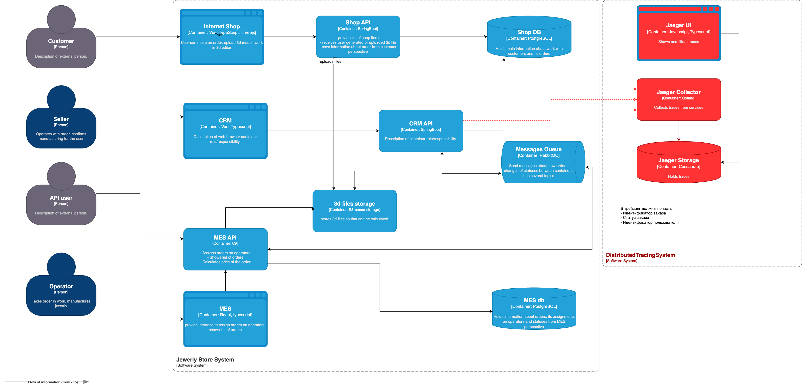

# Архитектурное решение по трейсингу

## Мотивация

Внедрение трассировки требуется для решения проблемы пропавших заказов.
Трассировка поможет отследить заказ в существующей распределенной системе и локализовать место, где он может потеряться.
Решение позволит выявлять и отслеживать наиболее проблемные места с точки зрения производительности.

Это особенно важно для унаследованного проекта MES, так как его код написан другой командой и трассировка сильно ускорит поиск причин проблемы

### Технические и бизнес-метрики, на которые может повлиять внедрение трассировки

- Response time (latency)
- Number of HTTP 500
- Время обработки файла в MES
- Количество успешно выполненных заказов

## Предлагаемое решение

Инструменты - OpenTelemetry, Jaeger, Cassandra

Потребуется добавление SDK OpenTelemetry для проектов:
- Shop API
- SRM API
- MES

Распределенная трассировка потребует наблюдения за синхронным и асинхронным взаимодействием между сервисами.
Требуется решение, которое позволит передавать trace_id и контекст через брокер сообщений.
В связи с длительным циклом производства, требуется хранить данные трассировки в постоянном хранилище, например Cassandra

[jewerly_c4_model_with_jaeger.drawio](jewerly_c4_model_with_jaeger.drawio)

## Компромиссы

- Увеличение стоимости инфраструктуры. Трейсинг требует системы хранения данных и вычислительных ресурсов и увеличит издержки. Как компромисс можно снизить sample rate и писать только часть запросов. Также можно пойти дальше и сохранять трейс только при ошибках
- Усложнение кода. Трейсинг требует внедрять его в участки кода, усложняя его
- Увеличение нагрузки на DevOps-инженера. Метрики потребуют обслуживания системы и затрат со стороны единственного DevOps в штате

## Аспекты безопасности

UI-интерфейс может содержать чувствительную иформацию, поэтому доступ к нему следует закрыть из внешней сети.
Для доступа к интерфейсу потребуется применить VPN.
Также для UI-интерфейса настроить права доступа и предоставить доступ разработчикам, DevOps и специалистам техподдержки
