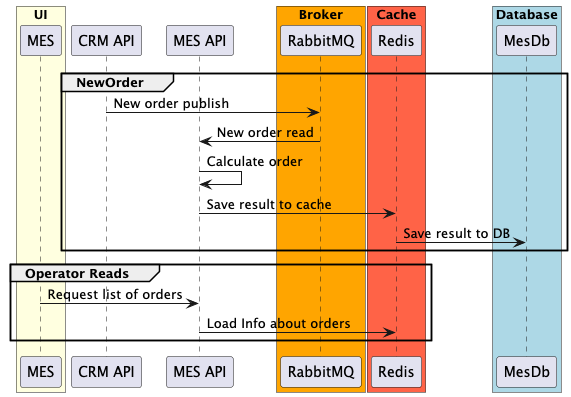

# Архитектурное решение по кэшированию

Необходимо закэшировать те части системы, по которым имеются задержки запросов.
Сейчас по обращениям это CRM-API и MES-API.
Также мониторинг поможет выявить и другие части системы, требующие ускорения

## Мотивация

Кэширование - инструмент, который позволяет сильно ускорить систему за короткое время и небольшие ресурсы.
Система работает с большим количеством разных данных, часть из которых никогда не меняется. Например, результат обработки системой MES.
Единожды сформированный отчет не требует изменений.

Также можно закэшировать информацию о заказе и его статус. Но это потребует инвалидации кэша.

## Предлагаемое решение

Необходимо внедрить серверное кэширование. Значительное время занимает именно обработка MES со стороны сервиса и запросы на список заказов.

Выбран паттерн **Write-Through**, так как операторы и менеджеры CRM должны работать с максимально свежими данными и задержка, связанная с Cache Miss в случае выбора Cache Aside недопустима.
**Cache Aside** как самый простой паттерн кэширования можно будет применить для каталога изделий, если метрики покажут высокую задержку этой части системы.

### Инвалидация кэша

В случае Write-Through инвалидация не требуется, но в случае отказа кэша потребуется загрузить в него данные из базы.
Требуется механизм синхронизации кэша.
Предлагаю программно восстанавливать кэш еще не завершенных заказов.
Также при "промахе" брать напрямую из базы как было бы в случае с Cache Aside
